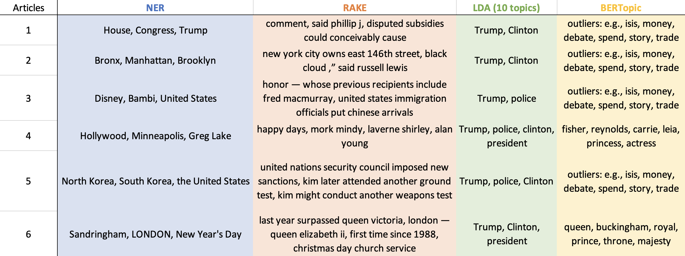

# NLP Project
## Topic extraction
The purpose of this project is to classify news articles by which topic they belong to via topic extraction. The use of 4 different models was explored for this purpose.

### Data
- The data set was downloaded from Kaggle at: https://www.kaggle.com/snapcrack/all-the-news?select=articles3.csv
- Data files are tracked by git lfs
- The same preprocessing steps were taken for all topic extraction models
    - Import data from CSV into structured and labelled dataframe format
    - Use Spacy nlp pipeline to normalise the article texts
        - lowercase
        - strip tags
        - strip punctuation
        - strip multiple whitespaces
        - strip numbers
        - remove stopwords
        - strip short words (less than 3 characters)
        - Lemmatize
        - --> Sample text: 'Hello, my name is something you'll never guess, Kim! ...But I wrote my signature. Right! My parents called me this, what can I say?' --> ['hello', 'guess', 'kim', 'write', 'signature', 'right', 'parent', 'call']

### Models
Reasons for not using any supervised models:
- Getting enough labelled data is infeasible
- Supervised models are not as relevant since most cases must be computed with unlabelled big data arriving in real time
- I wanted to challenge myself, with labelled data I could've embedded the words into vectors after preprocessing and fed the vectors into most classification models, too similar to sentiment analysis which I've already done, wanted to explore something new

#### NER
- Name Entity Recognition
- Aim:
    - Extract different types of entities from a text to understand what or who the text is about

#### RAKE
- Rapid Automatic Keyword Extraction
- Aim:
    - Remove stopwords and use phrase delimiters to locate content bearing phrases

#### LDA
- Latent Dirichlet Allocation
- Aim:
    - Cluster texts to discover latent topics
    - Process words and assign them weights indicating their contribution to a topic
    - 2 models: topic per document and words per topic
- Additional preprocessing:
    - Create a dictionary from corpus of articles
    - Filter out tokens that appear in less than 3 documents
    - Transform each article into a bag-of-words model
    - Add tf-idf weights to bow models
- Results, i.e., coherence score per number of topics:
    - 0.8083057157790445 with 500 topics (number found by BERTopic model --> empty topics)
    - 0.5065700357269545 with 200 topics (many words reappeared in multiple topics --> reduced the number of topics)
    - 0.3554205987715327 with 100 topics
    - 0.34805681617956025 with 50 topics
    - 0.3538168453269389 with 20 topics
    - 0.3570446379596891 with 10 topics [selected]
    - 0.3879960200020037 with 5 topics (maybe it's not enough topics...)

#### BERTopic
- BERT (Bidirectional Encoder Representations from Transformers) based topic modelling technique
- Aim:
    - Vectorise documents, cluster vectors, find most common words in each cluster
- Pros:
    - No need to predetermine number of topics
    - Using pretrained BERT instead of bow contextualises embeddings
- Found 517 topics in 50k news articles

### Topic Extraction Comparison Across All Models
#### Articles:
1. WASHINGTON — Congressional Republicans have... [washington, congressional, republicans, new]
2. After the bullet shells get counted, the blood... [bullet, shell, count, blood, dry, votive, can]
3. When Walt Disney’s “Bambi” opened in 1942, cri... [walt, disney, ’s, ", bambi, ", open, critic]
4. Death may be the great equalizer, but it isn’t... [death, great, equalizer, be, n’t, necessarily]
5. SEOUL, South Korea — North Korea’s leader, ... [seoul, south, korea, north, korea, ’s, leader]
6. LONDON — Queen Elizabeth II, who has been b... [london, queen, elizabeth, battling, cold, wee]

#### Topics extracted per article from each model:

#### Conclusion
- NER gives accurate representations of what is being spoken about but is limited to type of topic (i.e., entity label)
- RAKE gives a good summary of the articles in the form of phrases. Regardless, they are too specific to pass for topics
- LDA has repetitive words in multiple topics and a majority of the topics are dominated by terms like Trump and Clinton which appear in a lot of articles
- BERTopic: Middleground between NER and LDA, not limited to entities but largely affected by majority terms and unable to identify many topics so they are combined into 'outliers' (i.e., topic -1)
##### Future Extensions
- Use pretrained models to classify all US political terms into 'US Politics', all terms related to food and fitness to 'Health', all terms related to art and celebrities into 'entertainment', etc.
- Take n-grams into account in pre-processing

### Questions
- What do you do when the word for the topic doesn’t exist in the text? For example topic extraction model finds 'USA, France, violence, military' but main topic is 'war'... (bring in another pre-trained model?)
- LDA: how do you select the number of topics? Is there a more efficient way than by trial-and-error?
- How can I measure the performance of unsupervised models? Other than coherence scores...
- Do NER (and RAKE) outputs count as topics?
- Are there any topic extraction models I haven't considered?